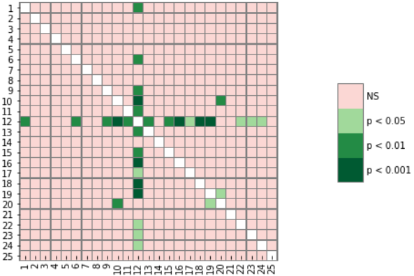

# weight-initialization-significance-measurement

Exploring the open question in section 4.3 of [Fine-Tuning Pretrained Language Models: Weight Initializations, Data Orders, and Early Stopping](https://arxiv.org/abs/2002.06305)

## Post hoc analysis 
See [the notebook](https://github.com/JoshuaPostel/weight-initialization-significance-measurement/blob/master/weight_initialization_analysis.ipynb) for details.  Slight deviation from proper Kruskal-Wallis test methodology.

